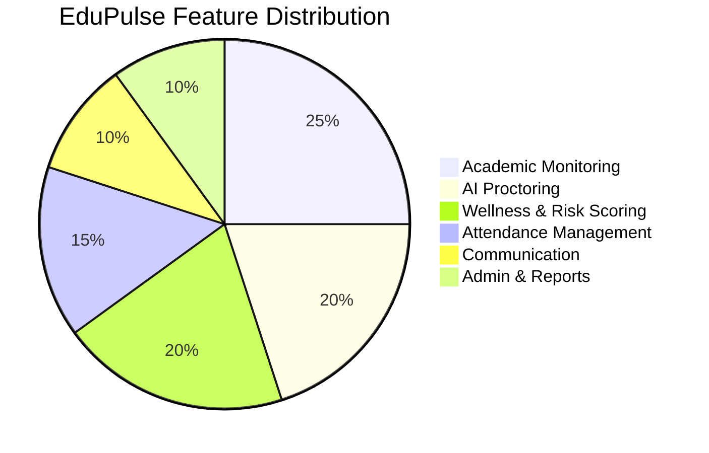
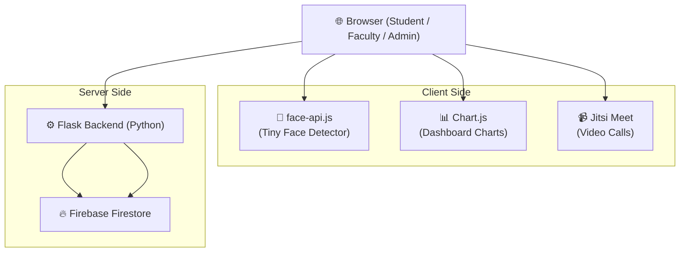
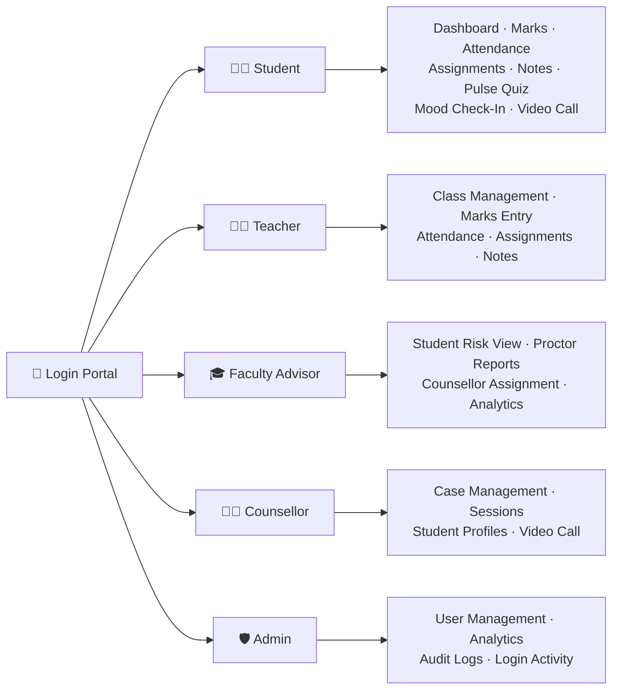
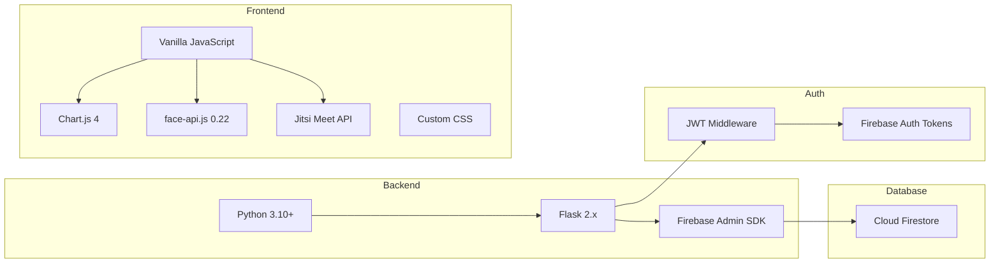
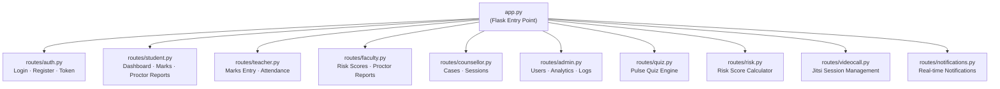
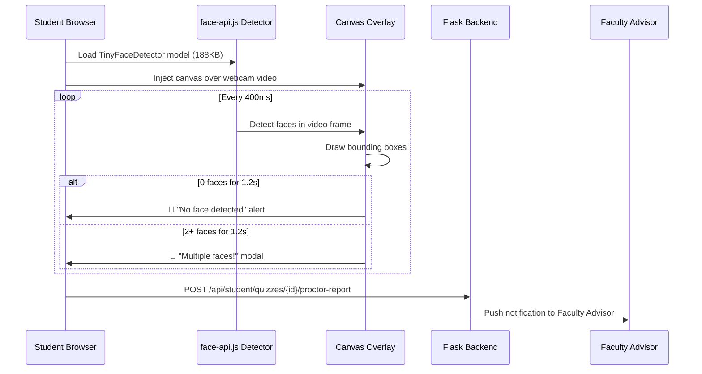
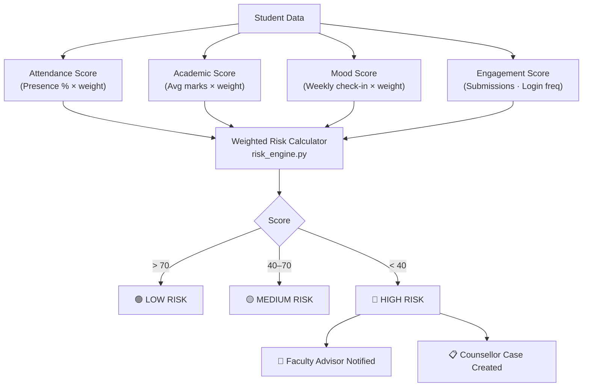
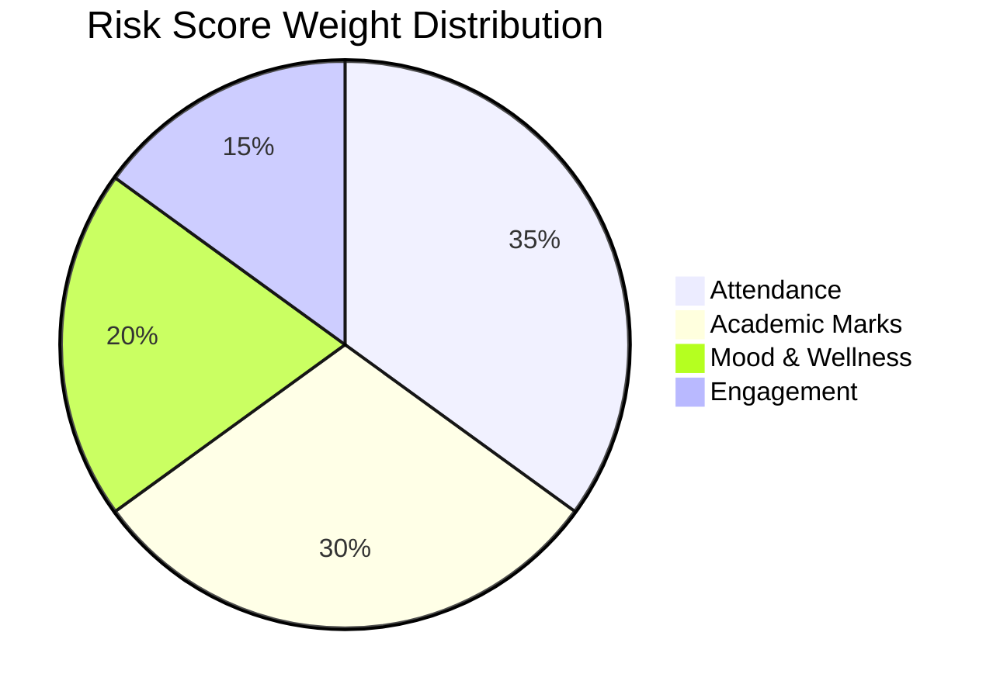

<div align="center">

# 📚 EduPulse

### AI-Powered Student Wellness & Academic Monitoring Platform

[](https://python.org)
[](https://flask.palletsprojects.com)
[](https://firebase.google.com)
[](https://developer.mozilla.org/en-US/docs/Web/JavaScript)
[](LICENSE)

*A full-stack academic platform combining real-time AI proctoring, risk analytics, student wellness tracking, and multi-role dashboards — all in one unified system.*

</div>

---

## 📑 Table of Contents

- [Overview](#-overview)
- [Live Architecture](#-live-architecture)
- [Role-Based Access](#-role-based-access-control)
- [Feature Matrix](#-feature-matrix)
- [Tech Stack](#-tech-stack)
- [Module Breakdown](#-module-breakdown)
- [AI Proctoring System](#-ai-proctoring-system)
- [Risk Scoring Engine](#-risk-scoring-engine)
- [Database Structure](#-database-structure)
- [Setup & Installation](#-setup--installation)
- [Seeding the Database](#-seeding-the-database)
- [Project Structure](#-project-structure)

---

## 🌟 Overview

**EduPulse** is a comprehensive student management and monitoring platform designed for educational institutions. It combines academic tracking with mental wellness monitoring and AI-powered exam proctoring to give faculty advisors, counsellors, and administrators a 360° view of each student.



---

## 🏗 Live Architecture



---

## 👥 Role-Based Access Control



| Role | Dashboard | Marks | Attendance | Proctor Reports | Risk Engine | Video Call | Admin Panel |
|---|:---:|:---:|:---:|:---:|:---:|:---:|:---:|
| **Student** | ✅ | View | View | ❌ | View own | ✅ | ❌ |
| **Teacher** | ✅ | Enter | Enter | ❌ | ❌ | ❌ | ❌ |
| **Faculty Advisor** | ✅ | View | View | ✅ | ✅ | ❌ | ❌ |
| **Counsellor** | ✅ | View | View | ❌ | View | ✅ | ❌ |
| **Admin** | ✅ | ❌ | ❌ | ❌ | ❌ | ❌ | ✅ |

---

## 🧩 Feature Matrix

| Feature | Description | Status |
|---|---|:---:|
| 🎥 AI Webcam Proctoring | Real face detection via face-api.js, 400ms detection loop | ✅ |
| 📦 Bounding Boxes | Green (1 face), Red (multiple faces) with confidence % | ✅ |
| 🚨 Multi-Face Alert | Malpractice alert when 2+ faces detected for >1.2s | ✅ |
| 🖥️ Fullscreen Enforcement | Quiz locks to fullscreen; exit triggers alert | ✅ |
| 🔄 Tab Switch Detection | Visibility API monitors tab changes during quiz | ✅ |
| 📊 Proctor Report | Full behavioral report: emotion log, focus chart, risk score | ✅ |
| 📬 FA Notification | Proctor report auto-sent to Faculty Advisor on submit | ✅ |
| 📈 Risk Scoring | ML-inspired weighted scoring across attendance, marks, mood | ✅ |
| 😊 Mood Check-In | Daily student wellness tracking with trend analysis | ✅ |
| 📝 Assignment Tracker | File upload with Google Drive link visibility for FA | ✅ |
| 💬 AI Messaging | Contextual AI-generated messages between users | ✅ |
| 📹 Video Calls | Jitsi Meet iFrame integration for counsellor sessions | ✅ |
| 🔔 Real-Time Notifications | Bell icon with live notification feed | ✅ |
| 🌙 Dark/Light Mode | Full theme toggle with system preference detection | ✅ |
| 🛡️ Admin Analytics | Login logs, user management, platform analytics | ✅ |

---

## 🛠 Tech Stack



| Layer | Technology | Purpose |
|---|---|---|
| **Backend** | Flask (Python) | REST API, routing, server-side logic |
| **Database** | Firebase Firestore | NoSQL real-time document store |
| **Auth** | Firebase Auth + custom JWT middleware | Token verification per role |
| **Face Detection** | face-api.js (TinyFaceDetector) | Client-side real-time face tracking |
| **Charts** | Chart.js 4 | Dashboard visualisations |
| **Video** | Jitsi Meet iFrame API | Peer-to-peer video sessions |
| **Styling** | Custom CSS + CSS Variables | Dark/Light theme system |
| **AI Messaging** | Anthropic Claude API | Context-aware AI message suggestions |

---

## 📦 Module Breakdown



---

## 🎯 AI Proctoring System

The **EduPulse Proctoring Engine** (`static/js/quiz-proctor.js`) runs entirely in the browser using `face-api.js`.



### Verdict Thresholds

| Risk Score | Verdict | Colour |
|---|---|---|
| ≥ 75 | ✅ CLEAN | 🟢 Green |
| 40 – 74 | ⚠️ SUSPICIOUS | 🟡 Amber |
| < 40 | 🚨 MALPRACTICE SUSPECTED | 🔴 Red |

### Scoring Penalties

| Event | Penalty |
|---|---|
| Tab switch | −20 pts |
| Suspicious behaviour flag | −15 pts |
| Face missing event | −10 pts |
| Anxious emotion detected | −5 pts |

---

## 📉 Risk Scoring Engine





---

## 🗃 Database Structure

| Collection | Key Fields | Used By |
|---|---|---|
| `users` | uid, role, classId, customId, name | All roles |
| `classes` | classId, name, facultyAdvisorId | FA, Teacher |
| `marks` | studentId, subject, score, maxScore, type | Teacher, Student |
| `attendance` | studentId, subject, date, status | Teacher, Student |
| `assignments` | classId, title, dueDate, driveLink | Teacher, FA |
| `riskScores` | studentId, riskScore, riskLevel | FA, Counsellor |
| `moodCheckins` | studentId, mood, date, note | Student, Counsellor |
| `proctorReports` | studentId, verdict, riskScore, emotionLog | FA |
| `notifications` | userId, title, message, read | All roles |
| `videoSessions` | counsellorId, studentId, jitsiRoom | Counsellor, Student |
| `counsellorCases` | studentId, counsellorId, status | Counsellor, FA |

---

## 🚀 Setup & Installation

### Prerequisites

- Python 3.10+
- Firebase project with Firestore enabled
- Service account key (`serviceAccountKey.json`)

### 1. Clone the repository

```bash
git clone https://github.com/jatinkothari2007/Edupulse.git
cd Edupulse
```

### 2. Create and activate virtual environment

```bash
python -m venv venv
# Windows
venv\Scripts\activate
# macOS/Linux
source venv/bin/activate
```

### 3. Install dependencies

```bash
pip install -r requirements.txt
```

### 4. Configure environment variables

Create a `.env` file in the project root:

```env
FIREBASE_PROJECT_ID=your-project-id
FIREBASE_CREDENTIALS_PATH=serviceAccountKey.json
ANTHROPIC_API_KEY=your-anthropic-key
SECRET_KEY=your-flask-secret
```

### 5. Add Firebase credentials

Place your `serviceAccountKey.json` in the project root (never commit this file).

### 6. Run the application

```bash
python app.py
```

Open `http://localhost:5000` in your browser.

---

## 🌱 Seeding the Database

Populate Firestore with demo data (users, classes, marks, attendance, assignments):

```bash
python full_seed.py
```

### Demo Accounts Created

| Role | Email | Password |
|---|---|---|
| Admin | admin@edupulse.com | Admin1 |
| Faculty Advisor | faculty@edupulse.com | Admin1 |
| Teacher | teacher@edupulse.com | Admin1 |
| Counsellor | counsellor@edupulse.com | Admin1 |
| Student | karan@edupulse.com | Admin1 |
| Student | riya@edupulse.com | Admin1 |

> ⚠️ Change all passwords before any production deployment.

---

## 📁 Project Structure

```
EduPulse/
├── app.py                      # Flask entry point
├── firebase_config.py          # Firestore client setup
├── risk_engine.py              # Risk scoring algorithm
├── full_seed.py                # Database seeder
├── requirements.txt
│
├── routes/
│   ├── auth.py                 # Login / register / token
│   ├── student.py              # Student APIs + proctor reports
│   ├── teacher.py              # Teacher APIs
│   ├── faculty.py              # FA APIs + proctor report view
│   ├── counsellor.py           # Counsellor APIs
│   ├── admin.py                # Admin APIs
│   ├── quiz.py                 # Pulse Quiz engine
│   ├── risk.py                 # Risk score calculator
│   ├── videocall.py            # Jitsi session management
│   └── notifications.py        # Notification system
│
├── templates/
│   ├── base.html               # Layout shell + nav
│   ├── login.html              # Role-select login page
│   ├── portal.html             # Role portal chooser
│   ├── dashboard/              # Role dashboards
│   └── pages/                  # Feature pages per role
│
├── static/
│   ├── css/                    # Theme, components, layout
│   ├── js/
│   │   ├── quiz-proctor.js     # AI Proctoring engine
│   │   ├── charts.js           # Chart helpers
│   │   ├── router.js           # SPA-style routing
│   │   ├── auth.js             # Firebase auth flow
│   │   └── notifications.js    # Live notification feed
│   └── models/
│       └── tiny_face_detector_model-weights_manifest.json
│
└── utils/
    ├── ai_messenger.py         # Anthropic Claude integration
    ├── cache.py                # API response caching
    ├── id_generator.py         # Custom student ID generator
    └── notifier.py             # Push notification helper
```

---

## 🤝 Contributing

1. Fork the repository
2. Create your feature branch: `git checkout -b feature/amazing-feature`
3. Commit your changes: `git commit -m 'feat: add amazing feature'`
4. Push to the branch: `git push origin feature/amazing-feature`
5. Open a Pull Request

---

## 📄 License

This project is licensed under the MIT License.

---

<div align="center">

Built with ❤️ for students, by students.

**[⬆ Back to Top](#-edupulse)**

</div>
